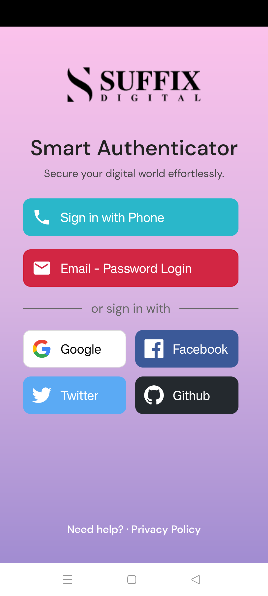
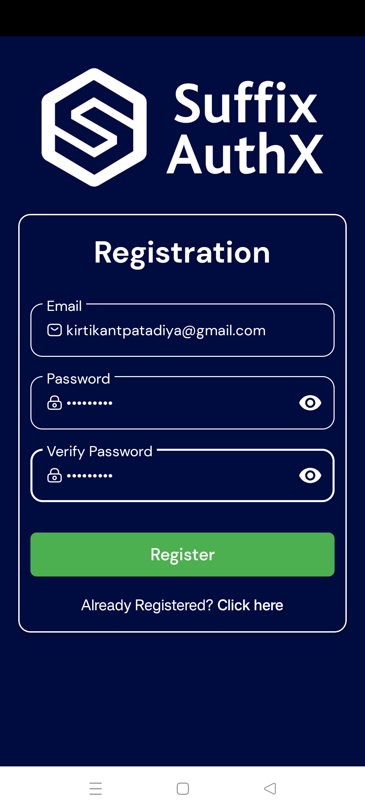
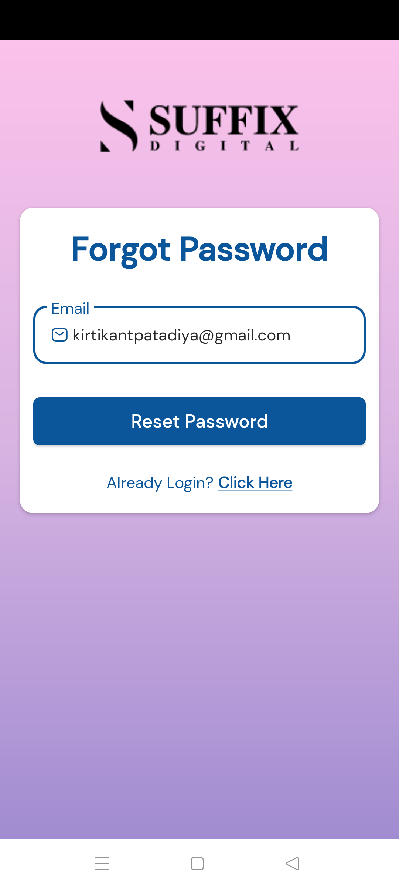
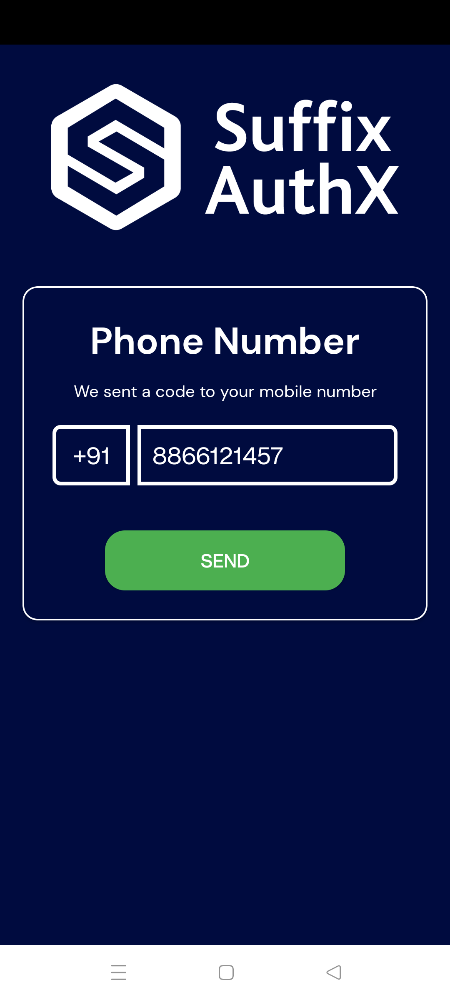
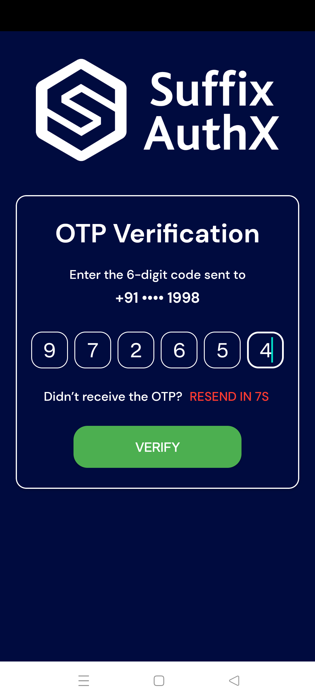
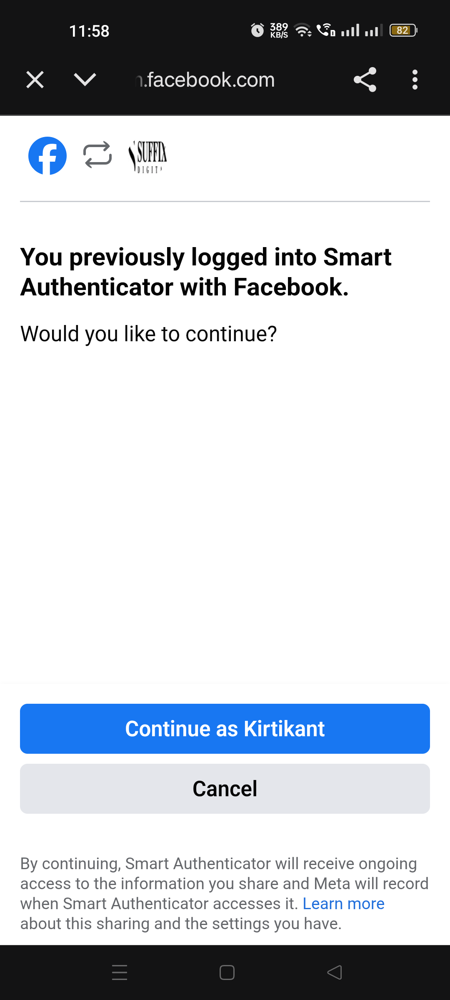
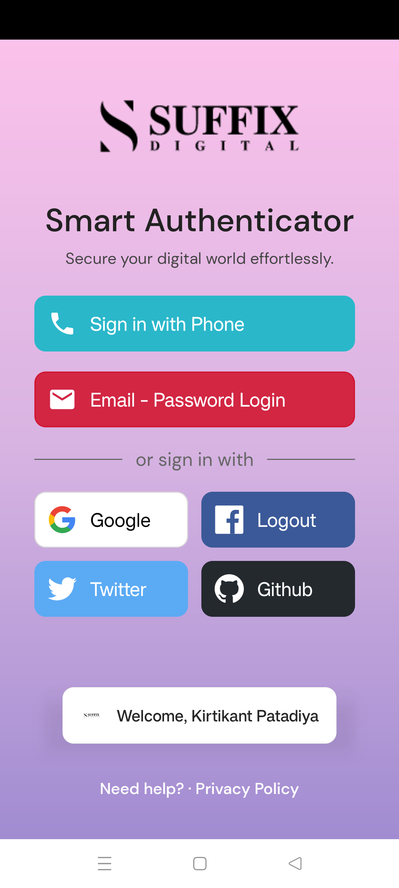

# Smart Authenticator – Android (Kotlin + Firebase)

A powerful and modular **multi-provider authentication app** built using Android’s **MVVM architecture** and **Firebase Authentication**. Ideal for apps requiring secure login with Email/Password, Google, Facebook, Twitter, and OTP verification.

---

## GitHub Badges


---

## App Overview

Smart Authenticator provides a ready-to-use **authentication boilerplate** for Android apps. It ensures:
- Fast and secure user login/signup
- Reusable codebase with clean separation of concerns
- Integration with most-used third-party auth providers

---

## Key Features

| Category         | Feature                                                                 |
|------------------|-------------------------------------------------------------------------|
| Authentication | Email/Password, Phone (OTP), Google, Facebook, Twitter                 |
| Session Handling | Firebase Auth state listeners to auto-login/auto-logout              |
| Architecture   | Clean MVVM (Model-View-ViewModel)                                      |
| Deep Links     | Handles social sign-in redirects properly                              |
| Validation     | Realtime input validation using `TextWatcher`                          |
| Network        | Internet connectivity checks with error fallback                       |
| UI Support     | Dark & Light mode                                                      |
| Secure Logout  | Sign out across all linked providers (Firebase, Google, etc.)          |
| Analytics Ready| Easily pluggable with Firebase Analytics (optional)                    |

---

## Tech Stack

- **Language**: Kotlin
- **Architecture**: MVVM + LiveData + ViewModel
- **Firebase Services**:
  - Authentication (Email, OTP, OAuth)
- **Third-Party SDKs**:
  - Google Sign-In
  - Facebook SDK
  - Twitter Kit
- **UI**:
  - Material Components
  - ConstraintLayout
  - Dark Mode Support

---

## Developer Guide

### Prerequisites

- Android Studio Giraffe or newer
- Firebase project with enabled Auth providers
- OAuth credentials from:
  - Google Cloud Console
  - Facebook Developer Portal
  - Twitter Developer Platform

### Setup Instructions

```bash
git clone https://github.com/Suffixdigital/Smart-Authenticator.git
cd Smart-Authenticator
```

1. Add your `google-services.json` to `app/`
2. Add Facebook & Twitter keys in `strings.xml`
3. Sync Gradle and Run!

---

## Project Structure

```
com.suffixdigital.smartauthenticator/
├── auth/               # Authentication logic (ViewModels, Repos)
├── ui/                 # Activities, Fragments
├── utils/              # Network & validation helpers
├── model/              # Data models
└── MainActivity.kt     # Entry point
```

---

## Screenshots

| Main Screen                                      | Register                                         | Login Screen                                     | Forgot Password                                      |
|--------------------------------------------------|--------------------------------------------------|--------------------------------------------------|------------------------------------------------------|
|              |  |            |   |

---

| Phone-Number Screen                              | OTP Screen                                       | Facebook Login                                   | Facebook Login Success                               |
|--------------------------------------------------|--------------------------------------------------|--------------------------------------------------|------------------------------------------------------|
|     |                |      | |


---

## Testing

- Manual login/signup with all methods
- Auto session resume
- Network disconnection test
- Incorrect credentials feedback

---

## License

MIT License

## Contact

[Suffix Digital] - [suffixdifital@gmail.com]
